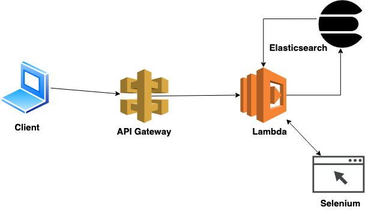

## Collector
Serverless application for collecting public 
information about website

Challenges:
-----------
 - Website data is not universally structured
 - Frontend rendering makes scrapping harder
 - Unstructured data for storing in database


Starting the application
-----
Requirements:

- Docker
- docker-compose

To start the application, need to run following:
```
docker-compose up
```

System Diagram
-------


Sources
-------
- LinkedIn
- Facebook
- Twitter
- Crunchbase
- Google

Storage Policies
----------------
I have used Elasticsearch to store the data in
separate Index for each source. As I have stored
in different indexes, it is easier to add a new index for
new sources. We can scale the data to multiple Elasticsearch
node if it grows more that can not be stored in one machine.

Each data sources index has a common key name `host` so
that while querying the data, we can use the host of the
domain to get the cached data.

Future Improvements
-----------
- Use Task queue like celery
- Set up the Selenium webdriver in remote machine 
  so that the serverless application 
  takes less time to response
- Scrap the website using Selenium
- Scrap LinkedIn with credentials for more data
